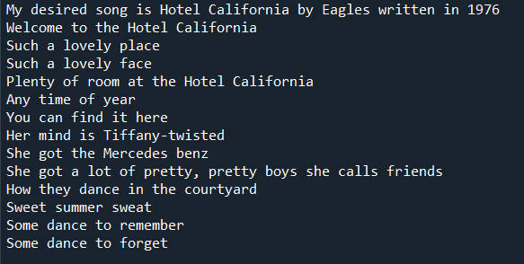

# Homework 1 - Lyrics 📜✒️🧑‍🎤🎶
Music & Poetry

This assignment is meant to ensure that you:
* Can run a Python program successfully
* Have a development environment that you feel comfortable with
* Get used to GitHub and committing code
* Express your creativity

I updated the [hw1-lyrics.py](hw1-lyrics.py) file to display my favorite song lyrics which is in English. I Update the documentation in the program comments and update the README to identify where I found the poem or lyrics and include a screenshot of my program running. My poem or lyrics need to be at least five (5) lines long. Below is an example of what the output from my program should look like. It is sourced from [Hotel California Lyrics](https://www.lyrics.com/track/664172/Eagles/Hotel+California).



### Important Note
If you will be using non-ASCII characters, then include the following two lines at the top of your program:
``` python
#!/usr/bin/env python
# -*- coding: utf-8 -*-
```
