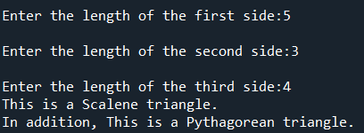

# Homework 2 - Triangles ◅△◺
Topics: input, logic, and functions

## Part 1 - Instructions
This part is reflected in the hw2_triangles python code.
it is meant to ensure that we:
* Can get input from a user and convert it to a numeric data type stored in variables
* Understand Boolean logic such as `<`, `<=`, `>`, `>=`, `==`, `!=`, `not`, `and`, `or`, `True`, and `False`
* Gain experience using `if`, `elif`, and `else`
* Implement and call functions
* Become familiar with the GitHub autograder

I updated the `hw2_triangles.py` file to:
1. Read three (3) numbers from the keyboard. These numbers represent the side lengths of a triangle.
2. Complete the given functions so that they work as expected.
* `isReal` tests that the sum of any two lengths is greater than the last length (i.e. `a + b > c`) and that each length is also valid, returning `True` when all conditions are met, `False` otherwise
* `isEquilateral` returns `True` whenever all three parameter lengths are the same, `False` otherwise
* `isIsosceles` returns `True` whenever two and only two sides are the same length, `False` otherwise
* `isScalene` returns `True` whenever all three parameter lengths are different values, `False` otherwise
* `isPythagorean` check for the condition that `a² + b² = c²` for any order of inputted lengths returning `True` when the condition is met otherwise `False`.
3. Run the program a few times testing various inputted numbers in these functions. When a real triangle is inputted it identifies the kind(s) of triangle it could be, otherwise it indicates that the triangle is not real.

Below is an example screenshot of what my program looks like.



 
 The documentation is modified in the program's comments to describe the changes I made.

 ## Part 2 - Reflection
 README is updated to answer the following questions:

 1. What is the logical difference between `a <= b` and `not (a > b)`? Hint: you may need to try testing a few values of `a` and `b` to see the behavior.In terms of LOGICAL difference, they are same and they did not showed different results, with any type of a and bs that I defined. 
 2. Should `isPythagorean(3,4,5)` and `isPythagorean(5,4,3)` return different results? Why or why not? A triangle with 3,4,5 lengths assigned to any of its sides should result in a Pythagorean Triangle, so the Code also should reflect it. It depends on if we consider other options in our code by using or. So isPythagorean(3,4,5) and isPythagorean(5,4,3) can return different results if we have not used the following format (a*a + b*b == c*c or c*c + b*b == a*a or a*a + c*c == b*b) in the return part. But it should be considered in the code, as they both eventually refer to a Pythagorean Triangle. 
 3. What happens when the user enters an input that is not a number? Why does this happen? If by mistake we enter w instead of a number, an error such as; ValueError: could not convert string to float: 'w', would occur. The reason is that although numbers are strings at first, but then with the FLOAT or INT we can convert it to mathematical floats or integers. However if the strings which are not numbers they have no chance to be converted into a mathematical floats or integers. 
 4. Can a triangle ever have a negative length? What about a length of zero? No, the triangle cannot have a negative length nor a length of zero. That is why we have to consider a, b, c greater than 0 in our code.
 5. Can a function call another function? Give an example from this lab in which you might, or might not, want that to happen? Yes, a function can call another function when a variable in a function refers to a variable defined in an earlier function. Forexample in this lab, isEquilateral, isIsosceles, isScalene, isPythagorean functions can call the initial isReal function. Also they all have same a, b, and c inputs which should be passed by the test in the initial isReal function to be used in other above-mentioned functions. 

 ---
 ## Running Tests Locally
 You do not have to wait for test results from GitHub because you can run tests on your own computer. The tester uses the program `pytest` which can be installed using the command `pip install -U pytest` (more info available at [https://docs.pytest.org](https://docs.pytest.org/en/stable/getting-started.html)). Use the following command in a regular terminal ***not* Powershell**. If you are in Powershell on Windows enter the normal command line `cmd`.

 ``` bash
 pytest -s < test_input.txt
 ```
