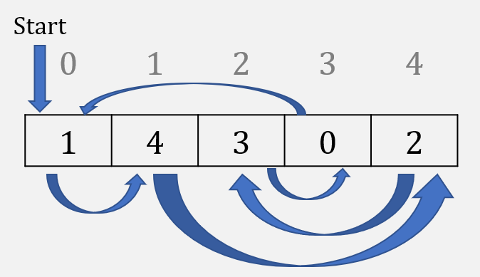
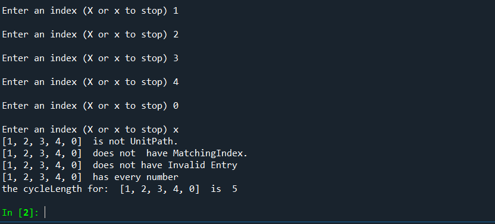

# Homework 3 - Cycles 🔁♻️♾️💫
Topics: lists, loops, and more functions

Imagine you are given the following sequence `[1,4,3,0,2]` meaning starting at node 0 you travel to node 1, then to node 4, then node 2, afterwards to node 3, then finally back to node 0 and repeat the cycle. Here is a visualization of that sequence:



Detecting when a given sequence has a cycle has uses in cryptography and [data science](https://towardsdatascience.com/10-graph-algorithms-visually-explained-e57faa1336f3). This homework will *not* ask you to implement any [sophisticated algorithms](https://en.wikipedia.org/wiki/Cycle_detection#Algorithms) for detecting cycles. You will complete several functions that identify specific properties about any given path represented as a list. Your last function will follow the path, keeping track of the indecies visited, and stopping once you come to an index that you have already seen.

## Part 1 - Instructions
This assignment is meant to ensure that you:
* Can get input from a user and save into a list
* Understand how to iterate over a list
* Gain experience using `in`, `append`, and `range`
* Implement and call functions
* Become familiar with `while` and `for` loops

You will update the [hw3_cycles.py](hw3_cycles.py) file to:
1. Ask the user to enter an undetermined number of integers, stopping when the user enters 'X' or 'x'.
2. Complete the given functions so that they work as expected.
* `isUnitPath` only returns `True` when the path list parameter is equivalent to `[0]`, `False` otherwise
* `hasMatchingIndex` returns `True` whenever a path list element matches its corresponding index (i.e. `[2,1,0]` has element `1` at index `1`), `False` otherwise
* `hasInvalidEntry` returns `True` whenever the path is empty or any path list elmement is outside the range of possible indexes (i.e. `[-2,42,0]`), `False` otherwise
* `hasEveryNumber` returns `True` whenever the range of elements is entirely included in the path list (i.e. `[2,4,1,0,3]`), `False` otherwise
* `cycleLength` follows the path starting from index 0 and returns the length of the path until a cycle is found (i.e. `[2,4,1,0,3]` returns 5, `[0,5,6,4,2,3,1]` returns 1, `[1,0,2]` returns 2). Should the path list contain any invalid entries or is empty, have it return 0.
* *Note*: In the event that the path passed to your functions is empty immediately return `False` (unless specified otherwise) or 0, depending on the return type of the function.
3. Run your program a few times testing various inputted paths. When the inputted path is not valid the program should let the user know, otherwise it will identify how many steps are in the path until a cycle is found. Be careful to avoid infinite loops.

Below is an example screenshot of what your program could look like (it does not need to look exactly like this).

 
 Modify the documentation in the program's comments to describe the changes you made.

 ## Part 2 - Reflection
 Update the README to answer the following questions:

 1. How do you access what is stored in a list given an index? A while loop can be used with the initial index of 0 (i = 0). Then the index can increase by adding 1 each time so that we can have i=1, i=2, ….. , i=n-1. The loop will stop when the i is n-1. To be more specific, n here is the length of the list wo when we define the while loop we should use while i <= len(path)-1: . also if a specific item of a list of path is required, then we can use path[i], where the i the number of the index. 
 2. What would happen if you did not check for the path containing numbers outside of the index range, like -1 when computing the length? Generally the length of any list depends of the number of items in it, so if there is -1 in the list, then it would also be counted in the length. Therefore, if we did not check the path for containing invalid items, and it can get invalid numbers, then the simple length function would calculate the -1 as the item in the list, and if it s only -1 in the list, then the list would show 1 as length. However in this assignment (HW3), in the  cycleLength part, if in the initial stages we can prevent the path to get invalid numbers, then we would not necessarily check it in the cycleLength part however a double check is always a good strategy. 
 3. Explain the [append()](https://www.w3schools.com/python/ref_list_append.asp) function in your own words. Append function adds an item, written in the parathesis beside the append function, to a given list of item. The item which will append to a list, is always added to the end of the list, as the latest item.
 4. When is it preferable to use a `while` loop instead of a `for` loop? A while loop can be used when we want an action to repeat itself till our defined condition occur. On the other hand, a for loop can be used when we want a pre-specified number of iterations through an object, list, array, … . 
 5. What does it mean when a list has a length of zero (i.e. `print(len(path))` outputs `0`)? It means there is no item in that list. For example if the path is a list with the length of zero, the path should be []. 

 ---
 ## Running Tests Locally
 You do not have to wait for test results from GitHub because you can run tests on your own computer. The tester uses the program `pytest` which can be installed using the command `pip install -U pytest` (more info available at [https://docs.pytest.org](https://docs.pytest.org/en/stable/getting-started.html)). Use the following command in a regular terminal ***not* Powershell**. If you are in Powershell on Windows enter the normal command line `cmd`.

 ``` bash
 pytest -s < test_input.txt
 ```
