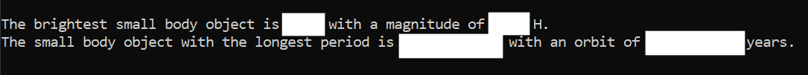

# Homework 4 - Space ☄️🪐🌌🚀👩‍🚀
Topics: files, lists, and loops

The data from this assignment comes from [JPL Small-Body Database](https://ssd.jpl.nasa.gov/sbdb_query.cgi) which has been queried and cleaned for your convience. It contains information on essentially every spacial body that isn't a star nor planet. The fields you are using for this homework are the object's name, period (in years), and brightness (offically [absolute magnitude](https://en.wikipedia.org/wiki/Absolute_magnitude), the lower the value the brighter the object, *not* related to absolute value). Each attribute is given in a seperate file but the records are synced. For example Ceres has a magnitude of 3.4 H and a period of 4.6 years. Halley's Comet (on line 20) has a magnitude of 5.5 H and an orbital period of 75 years.

## Part 1 - Instructions
This assignment is meant to ensure that you:
* Can read data from a file and convert it to a list
* Understand iterating over a list with `for` loops
* Gain experience using `strip()`, `append()`, `len()`, and `range()`
* Implement and call functions with lists
* Become familiar with using real data

At a high level you will update [hw4_nasa.py](hw4_nasa.py) to:
1. Read the data from these files and save them in your program using functions and lists.
2. Convert lists of strings representing numbers to lists of floating point numbers.
3. Search through data and identify the object with the longest period (years to orbit).
4. Search through data and identify the object with the smallest magnitude (aka the brightest).

Below is an example screenshot of what your program could look like (it does not need to look exactly like this).



**Important:** When specifying file names do not give the full path. GitHub will not be able to run it. Only specify the name of the file i.e. "[object_names.txt](object_names.txt)" and nothing more. Because the program is in the same directory as the data it should find it easily.

Update the functions in [hw4_nasa.py](hw4_nasa.py) so that:
* `fileToList` will open a file with the given file name and return a list of strings without new line characters
* `strListToFloatList` accepts a list of strings and returns a new converted list of floats assuming that the list contains numbers
* `minIndex` returns the index of the minimum number from the list given as a parameter (-1 when the list is empty)
* `maxIndex` returns the index of the maximum number from the list given as a parameter (-1 when the list is empty)

 Modify the documentation in the program's comments to describe the changes you made.

 ## Part 2 - Reflection
 Update the README to answer the following questions:

 1. What was the brightest object and the one with the longest orbit? What were their values? The brightest small body object is  Eris  with a magnitude of  -1.1  H.
The small body object with the longest period is  Leleakuhonua  with an orbit of  35762.62285  years.
 2. If a function changes the list given as a parameter, does this change the original list outside the function? If so, why does this happen? If not, why does it not happen? Yes, function can change the original list unless it is renamed. For example, if we have the original list named as “list-1”, and then we define a function that can modify the list, such as appending an item to the list, the original list can be changes if at the end we return “list-1”. If we do not what to change the original list, we can define another name in the function and at the end return “list-2”.
 3. Why was it necessary to use the [strip()](https://www.w3schools.com/python/ref_string_strip.asp) function (or something like it) on the data? It was necessary because the data in the word document had spaces between each line, and it hinders to have all the data as the items of a list in python. So we had to delete the line spaces for each line of data. The stip() function deleted those unwanted line spaces.  
 4. What is the [zip()](https://www.geeksforgeeks.org/zip-in-python/) function and how might it be helpful in this program? If we have two (or multiple) lists of data with the corresponding items, then the zip() function can make all those corresponding data, joined as the single items of another list. For example here the zip() function could be helpful because we could have a list with the data of{[name0,magnitude0,period0] , [name1,magnitude1,period1], [name2,magnitude2,period2], …} . 
 5. Why did this assignment ask you to return an index of a minimum instead of the minimum? In essessence, why was the index necessary? The index itself was necessary because we needed to find out the name of that star with the minimum value of magnitude from another list. In other words, we needed to join the data from two different lists that had corresponding index items, and the only way to find out what was the name of the brightest star, was to know the star’s index in the “magnitude” list, and then use the same index for the “name” list. 

 ---
 ## Running Tests Locally
 You do not have to wait for test results from GitHub because you can run tests on your own computer. The tester uses the program `pytest` which can be installed using the command `pip install -U pytest` (more info available at [https://docs.pytest.org](https://docs.pytest.org/en/stable/getting-started.html)).

 ``` bash
 pytest
 ```

 Notice that this time the command is different from previous homeworks? That is because this progam does not use (nor expect) any keyboard input so it does not run your program when it imports your code. It will also work with Powershell because it doesn't use the '`<`' symbol.
