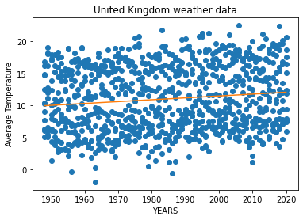

# Homework 6 - Heathrow 👩‍✈️🛫🌎☁️🌡️
Homework 6 practice on numpy and matplotlib

Data for this assignment comes from the the United Kingdom's weather agency known as the Met Office [metoffice.gov.uk](https://www.metoffice.gov.uk/). The exact dataset you will be using is recorded from a weather station at Heathrow Airport and stored in the [metoffice.gov.uk/pub/data/weather/uk/climate/stationdata/heathrowdata.txt](https://www.metoffice.gov.uk/pub/data/weather/uk/climate/stationdata/heathrowdata.txt) file.

## Part 1 - Instructions
This assignment is meant to ensure that you:
* Can manipulate real data with programmatic cleaning
* Understand `numpy`, and `matplotlib`
* Gain experience analyzing multidimensional arrays
* Implement and call user-defined functions
* Become familiar with the plotting functions

You will complete the functions in [hw6_heathrow.py](hw6_heathrow.py) to:

1. Define a function called `average` which accepts two parameters, adds them together, divdes them by two, and returns that result.

2. Define a function called `cToF` which accepts a Celcius parameter and returns its Fahrenheit conversion.

3. Define a function called `fToC` which accepts a Fahrenheit parameter and returns its Celcius conversion.

Then complete `main` function so that it:
1. Loads the text data skipping the first seven (7) rows, and only uses columns 0, 2, and 3 with a [numpy](https://numpy.org/doc/stable/reference/generated/numpy.loadtxt.html) function.
2. Create a [plot](https://matplotlib.org/stable/api/_as_gen/matplotlib.pyplot.plot.html) of points using the year data as the domain and the average of the maximum and minimum as the range. You can convert the range to Fahrenheit if you prefer.
3. Plot a [regression line](https://www.kite.com/python/answers/how-to-plot-a-linear-regression-line-on-a-scatter-plot-in-python) to your figure.
4. Add a [title](https://matplotlib.org/stable/api/_as_gen/matplotlib.pyplot.title.html), [xlabel](https://matplotlib.org/stable/api/_as_gen/matplotlib.pyplot.xlabel.html#matplotlib.pyplot.xlabel), and [ylabel](https://matplotlib.org/stable/api/_as_gen/matplotlib.pyplot.ylabel.html#matplotlib.pyplot.ylabel) to your plot and customize your figure however you like.
5. [Save](https://www.kite.com/python/docs/matplotlib.pyplot.savefig) the figure and commit it to this repository. You can use any filetype you like (preference for svg and png).

This lab assignment assumes reading from a file. To ensure that GitHub can test and run your code, ***do not*** specify the entire path to the data file. The tester assumes no keyboard input.

## Part 2 - Reflection
Update the README to answer the following questions:

 1. Add the saved plot file here so it can be displayed in your README.md file.  
 2. What conclusion(s) can you draw from the graph you generated? Based on the graph generated from the United Kingdom’s weather data, the average temperature of the UK in the past 70 years, from 1950 to 2020, is increasing, even the slop of the line shows the increase of temperature. Overall global warming might be the reason for this increase. 
 3. How come your functions work on regular numbers as well as `np.ndarray`'s?NumPy is one of most fundamental Python packages for doing any scientific computing in Python. NumPy’s np.ndarray array structure offers numerical computing with Python. So basic arithmetic operations can be done with NumPy on np.ndarray similar to regular numbers. The defined functions for this assignment consists of arithmetic operations, but it was written for regular umbers but since arithmetic for np.ndarray I similar to regular numbers, the functions worked pretty well for the np.ndarray without a specific change, just the inputs were np.ndarray instead of regular numbers. 
 4. Compare the functions `loadtxt` and `open`. The open () is a function in python that opens a file and returns it as a file object. However The loadtxt() is a function of Python numpy class that loads the data from a text file and provides a fast reader for simple text files. The reason for loadtxt()  to be faster, is that this function has the feature of reading the lines one by one, and we can easily reach out to any data in a specific row or column, however in open() function we need extra coding to read lines which takes time and effort. 
 5. Explain the [`polyfit`](https://numpy.org/doc/stable/reference/generated/numpy.polyfit.html) function?This is a method used for fitting the data inside a polynomial function. It least squares the polynomial fit. Polynomials can be represented as a list of coefficients. The polyfit function fits a polynomial p(X) of degree deg to points (X, Y). This method returns a vector of coefficients p that minimizes the squared error in the order deg, deg-1, … 0.

 ---
 ## Running Tests Locally
 You do not have to wait for test results from GitHub because you can run tests on your own computer. The tester uses the program `pytest` which can be installed using the command `pip install -U pytest` (more info available at [https://docs.pytest.org](https://docs.pytest.org/en/stable/getting-started.html)). Use the following command to run `pytest`.

 ``` bash
 pytest
 ```
 ---
## Installing `numpy` and `matplotlib`
Use the following command to install numpy and matplotlib if you have not done so already. More documentation can be found on [numpy.org](https://numpy.org/install/) and [matplotlib.org](https://matplotlib.org/).
``` bash
pip install numpy matplotlib
```
